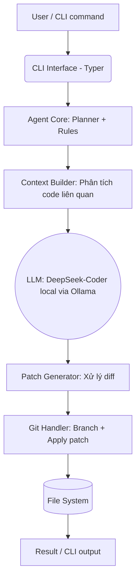

# 🤖 AgentCode

**AI-powered CLI Coding Assistant (Local LLM Engine)**


**AgentCode** là một công cụ hỗ trợ lập trình dạng dòng lệnh (CLI), sử dụng sức mạnh của các mô hình ngôn ngữ lớn (LLM) chạy hoàn toàn **cục bộ (Local)** thông qua hệ sinh thái Ollama (Mặc định sử dụng *DeepSeek-Coder*).

---

## ⚡ Các tính năng chính

- 💻 **CLI Gọn nhẹ**: Giao tiếp trực tiếp qua terminal thông qua lệnh `agent-code`.
- 🔒 **Bảo mật tuyệt đối**: Mọi dữ liệu mã nguồn đều được xử lý ở Local, không gửi lên bất kỳ server ngoài nào.
- 🛠️ **Hỗ trợ đa tác vụ**: Tự động sinh code, tìm lỗi (review), giải thích code (explain), chỉnh sửa (edit).
- 🔄 **Quản lý Git tích hợp**: Tự động rẽ nhánh, tạo patch, giúp bạn dễ dàng review lại code AI sinh ra trước khi commit.

---

## 🚀 Cài đặt (Installation)

### Yêu cầu hệ thống
- **Python**: `>= 3.10`
- **Ollama**: Đã cài đặt và đang chạy ([Tải Ollama](https://ollama.com))
- **Git**: Đã cài đặt trên máy

### Các bước cài đặt
```bash
# 1. Tải LLM model từ Ollama (DeepSeek-Coder)
ollama pull deepseek-coder-v2:16b

# 2. Cài đặt agent-code vào hệ thống
cd /home/vietpv/Desktop/AgentCode
pip install -e .

# 3. Kiểm tra cài đặt thành công
agent-code --help
```

---

## 🛠️ Hướng dẫn sử dụng (Usage)

### 1. `edit` — Sửa đổi mã nguồn theo yêu cầu
Tự động chỉnh sửa mã nguồn dựa trên prompt bằng cách tạo file patch/nhánh mới:
```bash
agent-code edit "add logging to all functions" --file app.py
agent-code edit "fix the bug in authentication" 
agent-code edit "add input validation" --no-git
```

### 2. `explain` — Giải thích mã nguồn
Dùng để hiểu một file code hoạt động như thế nào:
```bash
agent-code explain --file utils.py
```

### 3. `review` — Tìm Bug & Tối ưu hoá
Phân tích file để tìm kiếm các vấn đề bảo mật, bug tiềm ẩn hoặc code smells:
```bash
agent-code review --file api.py
```

### 4. `generate` — Tạo mã nguồn mới
Tạo ra các file code, component, hoặc bộ test mới hoàn toàn:
```bash
agent-code generate "create a FastAPI server with /users CRUD"
agent-code generate "create unit tests for models.py"
```

### 5. `config` — Cấu hình hệ thống
Quản lý các thông số hệ thống, model LLM và cấu hình kết nối:
```bash
agent-code config --show
agent-code config --model deepseek-coder:6.7b
agent-code config --url http://localhost:11434
```

---

## 🏗️ Kiến trúc luồng xử lý (Architecture Flow)

Kiến trúc bên dưới thể hiện cách **AgentCode** xử lý một yêu cầu từ người dùng:


